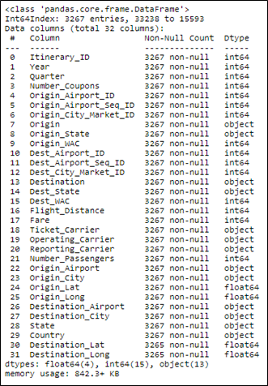
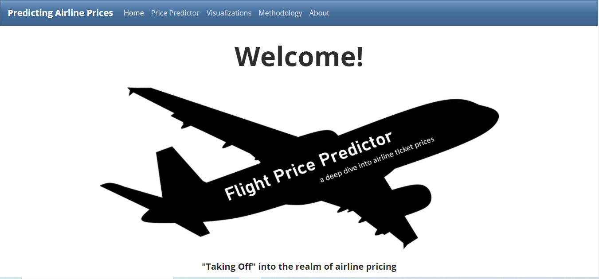

# Flight-Price-ML

## Data

The data used in this app is from the Bureau of Transportation Statistics Airline Origin and Destination Survey ("DB1BCoupon" and "DB1BTicket" tables). To make more meaningful data visualizations, we included the airport names, city names and coordinates (latitude, longitude). This required finding an appropriate dataset that contained these fields. We then joined this data to the BTS data using Python Pandas library.We based our visualizations on a random 5% sample of the last three years of data. 

This data was combined with an airport city, latitude and longitude for better visualizations. These can be found on the "Visualizations" page. Our flight price prediction model used a random 25% sample of Q1 2020 data from above. Our model is based on the most recent quarter as this most accurately reflects the current travel environment. Our model is based on Origin, Destination, Distance, Operating Carrier, Quarter, and Passenger Numbers. We used a "linear regression" model using these inputs as we noticed a higher correlation between these and flight ticket price.

  

## Machine Learning Model

### Overview

The purpose of the machine learning model is to predict the fare for domestic flights in the USA territory given only two inputs, origin airport code and destination airport code. To accomplish this purpose the dataset had to be fitted, trained and tested. 

### Model

To build this model, first we needed a correlation between our target, the Fare column, and the rest of the columns. With that result we decided to use the columns that had more than 5.6% correlation as futures in our model, the other columns were ignored because they were not truly relevant. Then we fit the data and divide it into 80% for training purposes and 20% for testing purposes, these parameters will apply to all the tested models. Also, the data of all the tested model was fitted and unfitted to see the results in both ways. 

First, the data was tested with linear models which included a Linear Regression, Logistic Regression model, K Neighbors Classifier, Support Vector Machine (SVM) and also Tree Models like: Random Forest Regressor, Decision Tree Classifier, Bagging Classifier, Random Forest Classifier, Ada Boost Classifier, Gradient Boosting Classifier and XTREME Gradient Boosting Classifier. That is a total of 22 models. 

  

Out of these 22 models the two with best results were the Linear Regression and Random Forest Regressor. Here is a comparison for both models: 

Although the Random Forest Regressor had a negative r2 score on the test, it had a better result on the Train and that is why it was tested on production with better results. 

Interface

We deployed our site on Heroku and laid out our analysis and prediction model on five pages (Home, Price Predictor, Visualizations, Methodology, About). Utilizing bootswatch, CSS and D3 event listeners, we were able to create a meaningful website for our end-users.

  

